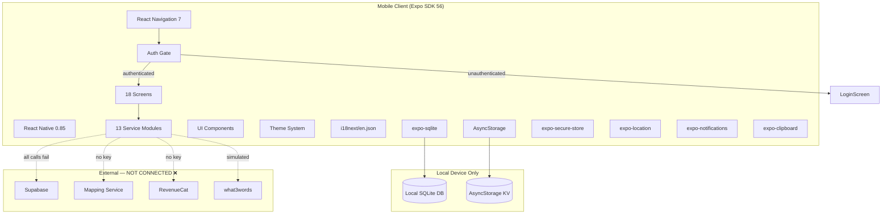
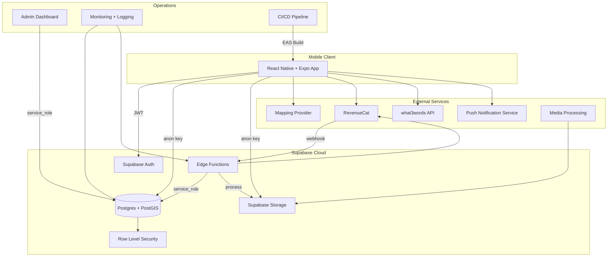

# Relief — Architecture

**Last updated:** 2026-07-12

---

## Current Architecture (As-Is)

The application is a **standalone React Native + Expo frontend** with no connected backend services.



### Key Characteristics

| Layer | Implementation | Notes |
|-------|---------------|-------|
| **Framework** | React Native 0.85 + Expo SDK 56 | Managed workflow |
| **Language** | TypeScript 6.0, strict mode | `tsconfig.json` extends `expo/tsconfig.base` |
| **Navigation** | React Navigation 7 | Native stack + bottom tabs; auth-gated root |
| **State** | React Context (Filters, Subscription) + local state | No global state library |
| **Persistence** | AsyncStorage (alert prefs), expo-sqlite (offline data), expo-secure-store | No encrypted remote storage |
| **Mapping** | `react-native-maps` with `PROVIDER_GOOGLE` | Google Maps provider; Mapbox token variable name used in config |
| **Auth** | Supabase Auth client (`@supabase/supabase-js`) | Client initialised with empty-string fallbacks |
| **Payments** | RevenueCat SDK (`react-native-purchases`) | Falls to console warning without API keys |
| **i18n** | i18next + react-i18next | English only; structure ready for expansion |
| **Fonts** | Inter + Plus Jakarta Sans (Google Fonts) | Loaded via `expo-font` |

### Navigation Architecture

```
RootNavigator
├── AuthNavigator (shown when unauthenticated)
│   └── LoginScreen
└── MainNavigator (shown when authenticated)
    ├── Tab: Map → MapStack
    │   ├── MapView (MapScreen)
    │   ├── FacilityDetail
    │   ├── AddFacility
    │   ├── ReportFacility
    │   ├── CorrectInfo
    │   └── AdvancedFilters
    ├── Tab: List (ListScreen)
    ├── Tab: Favourites (FavouritesScreen)
    └── Tab: Profile (ProfileScreen)
        └── (modal screens for premium features)
```

**Critical observation:** There is no unauthenticated route to any facility discovery screen. The auth gate in `AppNavigator.tsx` routes all unauthenticated users to `LoginScreen`.

### Service Layer

| Service | Primary Dependency | Current Behaviour |
|---------|-------------------|-------------------|
| `supabase.ts` | Supabase client | Initialised with empty URL/key; all queries will fail |
| `auth.ts` | Supabase Auth | Calls fail without Supabase project |
| `facilities.ts` | Supabase | Queries `facilities` table with spatial + filter constraints |
| `community.ts` | Supabase Auth + Storage | Submission, photo upload, report, correction operations |
| `favourites.ts` | Supabase | CRUD on `favourites` table |
| `profiles.ts` | Supabase | CRUD on `saved_profiles` table |
| `routePlanning.ts` | Supabase (geocoding) | Haversine distance + interpolation |
| `offlineMaps.ts` | Supabase + expo-sqlite | Downloads facility JSON; stores in local SQLite |
| `aiRecommendations.ts` | Supabase + client scoring | Weighted multi-factor scoring algorithm |
| `notificationAlerts.ts` | Supabase + AsyncStorage | Local polling with in-memory cooldown |
| `locationSharing.ts` | what3words API + client Plus Code | Simulated W3W; simplified Plus Code |
| `revenuecat.ts` | RevenueCat SDK | No-op without API keys |
| `notifications.ts` | expo-notifications | Push token registration |

### Feature Flags

Defined in `src/utils/env.ts`:

```typescript
FEATURES = {
  COMMUNITY: true,          // Community features enabled
  ADVANCED_FILTERS: false,  // Advanced filter screens disabled
  PREMIUM: false,           // All premium features disabled
  AI: false,                // AI-branded features disabled
  EUROPE: false,            // Europe expansion disabled
}
```

### Current Trust Boundaries

All application logic runs on the client device. There are **no server-side trust boundaries** — every service call to Supabase, RevenueCat, or what3words is client-initiated. The Supabase anon key (when configured) will be public by design per Supabase's security model.

---

## Target Architecture (Proposed — Not Deployed)



### Target Components

| Component | Technology | Purpose | Status |
|-----------|-----------|---------|--------|
| **Mobile Client** | React Native + Expo | User-facing application | ✅ UI implemented |
| **Supabase Auth** | Supabase Auth (GoTrue) | Email, Google, Apple authentication | 🔜 Proposed |
| **Postgres + PostGIS** | Supabase Postgres | Spatial facility data, user data, moderation queues | 🔜 Proposed |
| **Row Level Security** | Supabase RLS | Per-table access control | 🔜 Proposed (policies in migrations) |
| **Supabase Storage** | S3-compatible | Photo uploads, user content | 🔜 Proposed |
| **Edge Functions** | Deno (Supabase) | Report expiry, RevenueCat webhook, media processing | 🔜 Proposed (code written) |
| **Mapping Provider** | Google Maps (via `react-native-maps`) | Map display, geocoding | 🔜 Proposed (provider decided in code; config name mismatch) |
| **Routing Provider** | TBD | Road-aware route calculation | 🔜 Proposed (not yet selected) |
| **RevenueCat** | RevenueCat SDK + webhook | Subscription management, server-side validation | 🔜 Proposed (code written) |
| **what3words** | W3W API | Coordinate-to-words conversion | 🔜 Proposed (optional) |
| **Push Notifications** | Expo Push + FCM/APNs | Background alerts | 🔜 Proposed |
| **Media Processing** | Edge Function + external service | EXIF stripping, face blurring, moderation | 🔜 Proposed |
| **Admin Dashboard** | Web app (TBD) | Moderation, user management, analytics | 🔜 Proposed |
| **CI/CD** | EAS Build + Submit | Build, test, deploy pipeline | 🔜 Proposed |
| **Monitoring** | Sentry/PostHog | Error tracking, analytics | 🔜 Proposed |

### Target Environments

| Environment | Supabase Project | Purpose |
|-------------|-----------------|---------|
| **Development** | Separate org/project | Local and team development |
| **Staging** | Separate project | Pre-release testing with production-like data |
| **Production** | Separate project | Live user data |

---

## Key Architectural Decisions Required

See `docs/DECISIONS_NEEDED.md` for full decision log. Critical architecture decisions:

1. **Mapping provider** — Code uses Google Maps via `react-native-maps`; config variable named `MAPBOX_ACCESS_TOKEN`. Clarify and align.
2. **Routing provider** — No road-routing service selected. Route planner currently uses straight-line Haversine.
3. **Geocoding** — Currently uses facilities table lookup. Needs a proper geocoding API.
4. **Photo processing** — EXIF stripping and face blurring architecture not designed.
5. **Admin panel** — No technology or hosting decision made.
6. **Environment separation** — Development, staging, production Supabase projects needed.
