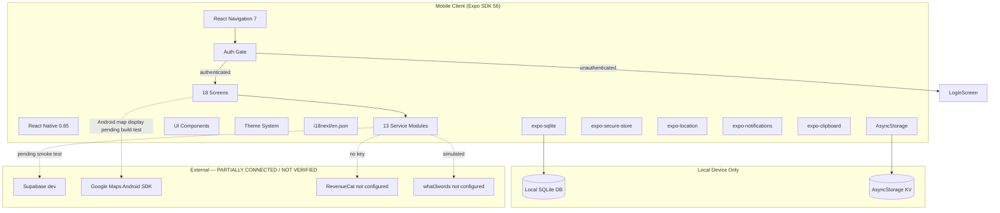
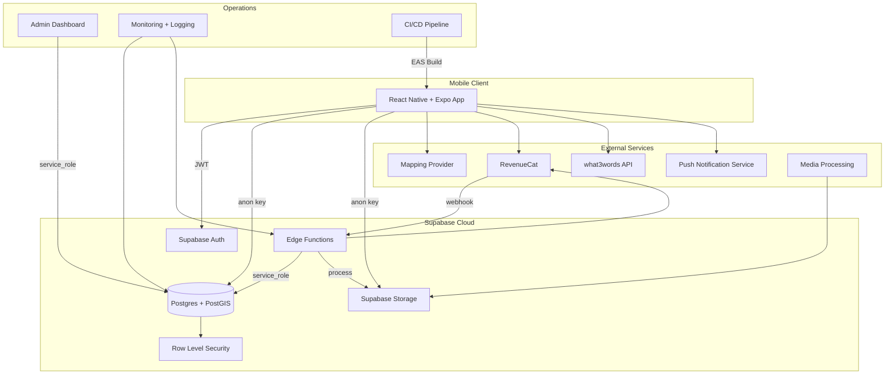

# Relief — Architecture

**Last updated:** 2026-07-25

---

## Current Architecture (As-Is)

The application is a **React Native + Expo frontend** with development backend setup in progress. Supabase schema deployment and Android Google Maps key setup are user-reported, but the app workflows are not yet VERIFIED end-to-end.


```mermaid
graph TD
    subgraph "Mobile Client (Expo SDK 56)"
        RN[React Native 0.85]
        NAV[React Navigation 7]
        AUTH_GATE[Auth Gate]
        SCRNS[18 Screens]
        SVCS[13 Service Modules]
        CMP[UI Components]
        THM[Theme System]
        I18N[i18next/en.json]
        SQLITE[expo-sqlite]
        ASYNC[AsyncStorage]
        SEC[expo-secure-store]
        LOC[expo-location]
        NOTIF[expo-notifications]
        CLIP[expo-clipboard]
    end

    subgraph "Local Device Only"
        SQLITE --> LDB[(Local SQLite DB)]
        ASYNC --> LKV[(AsyncStorage KV)]
    end

    subgraph "External — PARTIALLY CONNECTED / NOT VERIFIED"
        SUPABASE[Supabase dev]
        MAPS[Google Maps Android SDK]
        RCAT[RevenueCat not configured]
        W3W[what3words not configured]
    end

    NAV --> AUTH_GATE
    AUTH_GATE -->|authenticated| SCRNS
    AUTH_GATE -->|unauthenticated| LOGIN[LoginScreen]
    SCRNS --> SVCS
    SVCS -.->|pending smoke test| SUPABASE
    SCRNS -.->|Android map display pending build test| MAPS
    SVCS -.->|no key| RCAT
    SVCS -.->|simulated| W3W
```

### Key Characteristics

| Layer | Implementation | Notes |
|-------|---------------|-------|
| **Framework** | React Native 0.85 + Expo SDK 56 | Managed workflow |
| **Language** | TypeScript 6.0, strict mode | `tsconfig.json` extends `expo/tsconfig.base` |
| **Navigation** | React Navigation 7 | Native stack + bottom tabs; auth-gated root |
| **State** | React Context (Filters, Subscription) + local state | No global state library |
| **Persistence** | AsyncStorage (alert prefs), expo-sqlite (offline data), expo-secure-store | No encrypted remote storage |
| **Mapping** | `react-native-maps` with `PROVIDER_GOOGLE` on Android | Google Maps selected for Android MVP; `EXPO_PUBLIC_GOOGLE_MAPS_API_KEY` is the expected env var; iOS remains default provider for now |
| **Auth** | Supabase Auth client (`@supabase/supabase-js`) | Development Supabase URL/anon key are expected in `.env`; auth workflow pending smoke test |
| **Payments** | RevenueCat SDK (`react-native-purchases`) | Falls to console warning without API keys |
| **i18n** | i18next + react-i18next | English only; structure ready for expansion |
| **Fonts** | Inter + Plus Jakarta Sans (Google Fonts) | Loaded via `expo-font` |

### Navigation Architecture

```
RootNavigator
├── AuthNavigator (shown when unauthenticated)
│   └── LoginScreen
└── MainNavigator (shown when authenticated)
    ├── Tab: Map → MapStack
    │   ├── MapView (MapScreen)
    │   ├── FacilityDetail
    │   ├── AddFacility
    │   ├── ReportFacility
    │   ├── CorrectInfo
    │   └── AdvancedFilters
    ├── Tab: List (ListScreen)
    ├── Tab: Favourites (FavouritesScreen)
    └── Tab: Profile (ProfileScreen)
        └── (modal screens for premium features)
```

**Critical observation:** There is no unauthenticated route to any facility discovery screen. The auth gate in `AppNavigator.tsx` routes all unauthenticated users to `LoginScreen`.

### Service Layer

| Service | Primary Dependency | Current Behaviour |
|---------|-------------------|-------------------|
| `supabase.ts` | Supabase client | Uses `EXPO_PUBLIC_SUPABASE_URL` and `EXPO_PUBLIC_SUPABASE_ANON_KEY`; development project connection is user-reported, not yet app-verified |
| `auth.ts` | Supabase Auth | Calls Supabase Auth; workflow pending smoke test |
| `facilities.ts` | Supabase | Queries `facilities` table with spatial + filter constraints |
| `community.ts` | Supabase Auth + Storage | Submission, photo upload, report, correction operations |
| `favourites.ts` | Supabase | CRUD on `favourites` table |
| `profiles.ts` | Supabase | CRUD on `saved_profiles` table |
| `routePlanning.ts` | Supabase (geocoding) | Haversine distance + interpolation |
| `offlineMaps.ts` | Supabase + expo-sqlite | Downloads facility JSON; stores in local SQLite |
| `aiRecommendations.ts` | Supabase + client scoring | Weighted multi-factor scoring algorithm |
| `notificationAlerts.ts` | Supabase + AsyncStorage | Local polling with in-memory cooldown |
| `locationSharing.ts` | what3words API + client Plus Code | Simulated W3W; simplified Plus Code |
| `revenuecat.ts` | RevenueCat SDK | No-op without API keys |
| `notifications.ts` | expo-notifications | Push token registration |

### Feature Flags

Defined in `src/utils/env.ts`:

```typescript
FEATURES = {
  COMMUNITY: true,          // Community features enabled
  ADVANCED_FILTERS: false,  // Advanced filter screens disabled
  PREMIUM: false,           // All premium features disabled
  AI: false,                // AI-branded features disabled
  EUROPE: false,            // Europe expansion disabled
}
```

### Current Trust Boundaries

All application logic runs on the client device. There are **no server-side trust boundaries** — every service call to Supabase, RevenueCat, or what3words is client-initiated. The Supabase anon key (when configured) will be public by design per Supabase's security model.

---

## Target Architecture (Proposed — Not Deployed)


```mermaid
graph TD
    subgraph "Mobile Client"
        APP[React Native + Expo App]
    end

    subgraph "Supabase Cloud"
        AUTH[Supabase Auth]
        DB[(Postgres + PostGIS)]
        RLS[Row Level Security]
        STORE[Supabase Storage]
        EF[Edge Functions]
    end

    subgraph "External Services"
        GMAPS[Mapping Provider]
        RCAT2[RevenueCat]
        W3W2[what3words API]
        PUSH[Push Notification Service]
        MODERATION[Media Processing]
    end

    subgraph "Operations"
        ADMIN[Admin Dashboard]
        MONITOR[Monitoring + Logging]
        CI[CI/CD Pipeline]
    end

    APP -->|JWT| AUTH
    APP -->|anon key| DB
    APP -->|anon key| STORE
    APP --> GMAPS
    APP --> RCAT2
    APP --> W3W2
    APP --> PUSH

    DB --> RLS
    EF -->|service_role| DB
    EF -->|process| STORE
    EF --> RCAT2

    RCAT2 -->|webhook| EF
    MODERATION --> STORE

    ADMIN -->|service_role| DB
    MONITOR --> DB
    MONITOR --> EF
    CI -->|EAS Build| APP
```

### Target Components

| Component | Technology | Purpose | Status |
|-----------|-----------|---------|--------|
| **Mobile Client** | React Native + Expo | User-facing application | UI IMPLEMENTED |
| **Supabase Auth** | Supabase Auth (GoTrue) | Email, Google, Apple authentication | BACKEND-DEPENDENT — smoke test pending |
| **Postgres + PostGIS** | Supabase Postgres | Spatial facility data, user data, moderation queues | BACKEND-DEPENDENT — schema push user-reported |
| **Row Level Security** | Supabase RLS | Per-table access control | BACKEND-DEPENDENT — policy behaviour not verified |
| **Supabase Storage** | S3-compatible | Photo uploads, user content | PLANNED |
| **Edge Functions** | Deno (Supabase) | Report expiry, RevenueCat webhook, media processing | PLANNED — code written |
| **Mapping Provider** | Google Maps (via `react-native-maps`) | Android map display | BACKEND-DEPENDENT — Android key configured locally; build smoke test pending |
| **Routing Provider** | TBD | Road-aware route calculation | PLANNED |
| **RevenueCat** | RevenueCat SDK + webhook | Subscription management, server-side validation | PLANNED — code written |
| **what3words** | W3W API | Coordinate-to-words conversion | DEFERRED |
| **Push Notifications** | Expo Push + FCM/APNs | Background alerts | PLANNED |
| **Media Processing** | Edge Function + external service | EXIF stripping, face blurring, moderation | PLANNED |
| **Admin Dashboard** | Web app (TBD) | Moderation, user management, analytics | PLANNED |
| **CI/CD** | EAS Build + Submit | Build, test, deploy pipeline | PLANNED |
| **Monitoring** | Sentry/PostHog | Error tracking, analytics | PLANNED |

### Target Environments

| Environment | Supabase Project | Purpose |
|-------------|-----------------|---------|
| **Development** | Separate org/project | Local and team development |
| **Staging** | Separate project | Pre-release testing with production-like data |
| **Production** | Separate project | Live user data |

---

## Key Architectural Decisions Required

See `docs/DECISIONS_NEEDED.md` for full decision log. Critical architecture decisions:

1. **Routing provider** — No road-routing service selected. Route planner currently uses straight-line Haversine.
2. **Geocoding** — Currently uses facilities table lookup. Avoid paid geocoding APIs until explicitly needed.
3. **Photo processing** — EXIF stripping and face blurring architecture not designed.
4. **Admin panel** — No technology or hosting decision made.
5. **Environment separation** — Development Supabase exists per user report; staging and production separation still needed.
6. **Unauthenticated urgent access** — Basic "Need One Now" discovery still requires a navigation decision and implementation.
